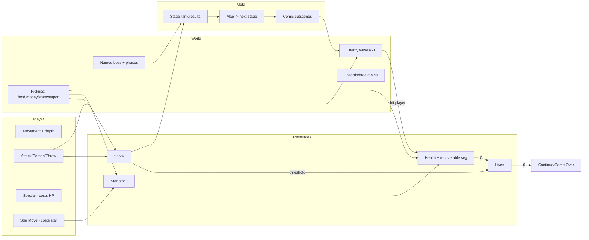

# Streets of Rage 4 — Gameplay Teardown & Reverse‑Engineering Document

> **Analyst role:** Game systems / gameplay design / technical art / UI‑UX / level design research
> **Method:** Frame‑accurate visual analysis of two YouTube gameplay captures. Videos were downloaded
> with `yt-dlp` and decomposed into contact‑sheet montages and full‑resolution key frames with `ffmpeg`.
> **Evidence tagging:** `[CONFIRMED]` = directly visible/legible on screen · `[INFERENCE]` = reasoned from
> visible evidence · `[UNKNOWN]` = cannot be determined from the footage.

## Source Material

| Ref | Video | Channel | Length | Value |
|-----|-------|---------|--------|-------|
| **LP** | `RzvgXCpAul0` — "Streets of Rage 4 FULL GAME Walkthrough No Commentary (Longplay)" | Noire Blue | 2:15:01 | Clean, overlay‑free full game start→credits. Primary source for flow, stages, bosses, ending. |
| **CK** | `-Jw6wK4GJds` — "…THIS GAME IS A MASTERPIECE \| Streets of Rage 4 Gameplay" | CoryxKenshin | 23:50 | Front‑end menus (title, character select, prologue) + early Stage 1. Has a webcam facecam overlay that occludes a screen corner. |

Timestamps below are prefixed **LP** (longplay) or **CK** (CoryxKenshin). Both videos are the **same game**.

**Game identification `[CONFIRMED]`:** *Streets of Rage 4*. The title logo appears on the attract screen
(CK ~1:00) and the closing credits (LP ~2:10:00) list **Lizardcube, Guard Crush Games, DotEmu and SEGA**,
plus a "Track List / Main Theme" music‑credits card.

---

## 1. High‑Level Game Summary

* **Genre `[CONFIRMED]`:** 2.5D side‑scrolling **beat‑'em‑up** ("brawler"). Hand‑drawn characters on
  parallax‑scrolling painted backgrounds.
* **Core loop `[CONFIRMED]`:** Walk right through a themed urban stage → crowds of enemies lock the screen
  ("arena" gates) → clear all enemies using melee strings, throws, weapons and special moves → screen
  unlocks (green **GO ▸** arrow, LP 1:00) → advance → fight a mid‑boss/boss with a named health bar →
  clear the stage → results/rank screen → next stage.
* **Player objective `[CONFIRMED / INFERENCE]`:** Confirmed short‑term: survive each stage and defeat its
  boss. Inferred campaign goal: dismantle the **"Y Syndicate"** run by the twins **Mr. Y and Ms. Y**
  (story crawl CK 4:00; villain cutscene LP ~24:00; final boss LP 127:00).
* **Camera `[CONFIRMED]`:** Fixed side‑on view that auto‑scrolls horizontally and locks during combat
  encounters. Characters can also move on a shallow **Z‑axis** (up/down "depth" on the floor plane) —
  visible from enemies staggered in depth and attacks that whiff when lanes don't align (LP 30:00, scan).
* **Visual style `[CONFIRMED]`:** Modern hand‑drawn comic/animation look; saturated neon color;
  cel‑style character art over richly painted environments.
* **Pacing `[CONFIRMED]`:** Rhythmic waves of combat punctuated by short traversal and brief comic‑panel
  story beats. Roughly ~10 minutes of play per stage in the longplay.
* **Player count `[CONFIRMED]`:** Single‑player campaign shown, but the character‑select screen exposes
  **"CREATE ONLINE GAME"** and **"PLAYER 2 JOIN GAME"** (LP 72:00) → **local co‑op and online co‑op** exist
  (PvE). No PvP or roguelike/open‑world elements are visible; structure is **linear stage‑based**.
* **Moment‑to‑moment `[CONFIRMED]`:** The player is repeatedly positioning, spacing, and chaining
  attacks into large hit‑combos against grouped enemies while managing health, star‑moves and weapons.

**Summary:** A polished, stage‑based arcade brawler. One of five street vigilantes fights through ~12
themed city stages of gang enemies and named bosses to bring down a crime syndicate led by twin villains,
scored on combos/time and graded per stage, with drop‑in co‑op.

---

## 2. Full Player Workflow (Launch → Completion)

| # | Step | Evidence | What happens |
|---|------|----------|--------------|
| 1 | **Attract / title** | CK ~1:00 | Key art of the heroes + **"PRESS ANY BUTTON"**; dev logos scroll at the bottom. `[CONFIRMED]` |
| 2 | **Main menu / mode select** | CK ~2:00–3:00 | Menu art transitions into mode/character flow. Exact top‑level menu labels are partly hidden by the facecam. `[INFERENCE]` a standard mode list (Story / Arcade / Boss Rush / Battle / Stages) is typical of this HUD but only Story flow is confirmed on screen. |
| 3 | **Story prologue** | CK 4:00; LP 0:05 | Animated crawl over a night skyline: *"Ten years have passed since the fall of Mr. X and his Syndicate… brilliant Dr. Zan. Together these four vigilantes stand against the Y Syndicate… Streets of Rage."* `[CONFIRMED]` |
| 4 | **Character select** | LP 72:00; CK 3:00 | Big P1 render (e.g. **BLAZE**) + a **roster portrait strip**; prompts **"Ⓐ OK / Ⓑ CANCEL"**, **"❌ CREATE ONLINE GAME"**, **"Ⓐ PLAYER 2 JOIN GAME"**. `[CONFIRMED]` |
| 5 | **Customization / loadout** | — | None shown. Characters are fixed movesets; no pre‑stage loadout. `[CONFIRMED absence]` |
| 6 | **Stage transition / map** | LP ~25:00 | An **isometric city map** with location pins and a burnt‑in label (**"CARGO SHIP"**) shows the next destination. `[CONFIRMED]` |
| 7 | **Stage title card** | LP ~25:10 | **"STAGE 3 START"** text wipes across the opening of play. `[CONFIRMED]` |
| 8 | **In‑stage play** | throughout | Scroll‑and‑brawl loop (see §1). `[CONFIRMED]` |
| 9 | **Boss encounter** | LP 9:40 (Diva), 23:00 (Commissioner) … | Screen locks, a **named boss health bar** appears at the bottom center. `[CONFIRMED]` |
| 10 | **Story beat** | LP ~24:00 | Comic‑panel cutscene with dialogue between stages. `[CONFIRMED]` |
| 11 | **Results / rank** | overview LP 64:00, 101:00 | Stage‑clear tally with a **letter rank** (a green **"C"** is legible) and score. `[CONFIRMED existence; some line items INFERENCE]` |
| 12 | **Next stage** | repeats | Loop returns to map → title card → play. `[CONFIRMED]` |
| 13 | **Final boss** | LP 127:00 | Giant mech piloted by **MS. Y** + **MR. Y** (twin health bars). `[CONFIRMED]` |
| 14 | **Completion** | LP ~2:10:00 | **Credits** roll (studios, staff, track list, pixel‑art cast). `[CONFIRMED]` |

**Workflow shape `[CONFIRMED]`:** **Menu‑driven front‑end → linear, map‑gated stage progression.** The
player makes exactly one meaningful pre‑game choice (character); everything after is a fixed sequence of
stages connected by cutscenes and a location map.

> **Observation `[CONFIRMED]` / mechanism `[INFERENCE]`:** In the longplay the **playable character changes
> between stages** (Axel S1 → Blaze S2 → Cherry S3 → Floyd, Adam later) and the **score resets** at those
> boundaries, and a character‑select screen re‑appears mid‑video (LP 72:00). Evidence supports that the
> longplay is a **compilation of per‑character runs / uses stage‑select**, not that a single story run
> lets you hot‑swap characters. The design fact is: *one character is chosen per run.*

---

## 3. Character Analysis

Five playable characters are confirmed from HUD portraits/name plates and the select roster.

| Character | Appearance `[CONFIRMED]` | Archetype `[INFERENCE]` | Evidence |
|-----------|--------------------------|--------------------------|----------|
| **Axel** | Blonde spiky hair, blue vest/jeans, headband, fingerless gloves | Balanced all‑rounder; fire‑infused specials (flaming uppercut/"Grand Upper", CK 5:00) | LP 1:00, CK 5:00 |
| **Blaze** | Brown ponytail, red top, athletic | Fast, agile, kick/acrobatic specials | LP 15:10, char‑select LP 72:00 |
| **Cherry** | Red hair, punk outfit, **carries an electric guitar** | Fast, low‑reach, mobility/runner; music‑themed | LP 28:00, 30:00, 76:00 |
| **Floyd** | Huge frame, **cybernetic arms** | Slow heavy grappler; long reach, high damage, low mobility | LP 33:00, 90:00 |
| **Adam** | Dark‑skinned, red top, athletic veteran | Balanced striker (returning SoR1 hero) | LP 101:00 |

**Animation & readability `[CONFIRMED]`:**

* Distinct **idle** breathing/stances and **taunt/flex** poses (Axel flexes, CK 9:00).
* Full traversal + combat set: walk, run (dust puffs), jump, attack strings, throws, weapon swings, and
  screen‑clearing **star moves** with large VFX.
* **Silhouette/scale:** Heroes are large, high‑contrast, and consistently lit brighter than the painted
  backgrounds; a subtle **contact shadow** anchors them to the floor plane, aiding depth reads.
* Characters are **highly readable** against busy backgrounds because enemies use a different, more
  muted palette and the hero carries the strongest rim/《key light.
* **Personality via animation `[INFERENCE]`:** Axel = confident brawler; Floyd = lumbering powerhouse;
  Cherry = energetic/punk; Blaze = graceful; Adam = veteran poise.

**Skins/customization `[UNKNOWN/absent in footage]`:** No skin or gear customization is shown; only the
base character models appear. (The pixel‑art cast on the credits card hints at **retro unlockables** but
that is not demonstrated in play — `[INFERENCE]`.)

---

## 4. Core Gameplay Mechanics

| Mechanic | Trigger `[INFERENCE unless noted]` | Feedback `[CONFIRMED]` | Role |
|----------|-------------------|----------|------|
| **Movement (8‑way on plane + depth)** | Directional input | Character faces travel dir; dust on run | Core |
| **Basic attack string** | Attack button repeated | Hitsparks, hitstop, **"N hits"** combo counter, floating damage `+204` | Core |
| **Combo system** | Chaining hits without dropping | Big center **combo counter** that changes color as it grows (green→blue), praise labels **"Super! / Nice! / Break!"** | Core, scoring‑critical |
| **Throws / grapples** | Grab into adjacent enemy | Enemy tossed (into others = extra hits) | Core |
| **Jump attacks** | Jump + attack | Aerial hit; combo extender | Core |
| **Weapons** | Pick up ground weapon | Katana slash arc (CK 12:00), pipes/bats/knives; can be thrown | Secondary |
| **Special / "Blitz" moves** | Attack + direction combos | Fire uppercut (Axel, CK 5:00), electric burst (LP 9:40) — cost **a small slice of health** that can be **earned back** by hitting enemies (green "recoverable" portion on the health bar, LP 15:10) `[CONFIRMED — on-screen tutorial "SPECIALS (⭕) DRAIN HEALTH — HIT ENEMIES TO RESTORE IT", CK ~5:55]` | Core risk/reward |
| **Star Move (screen special)** | Consumes one **★** | Big cinematic nuke VFX; **★ icons** decrement in HUD | Panic/burst button |
| **Health / damage** | — | Orange health bar depletes; character flashes on hit | Core |
| **Lives** | — | Red number under portrait ("AXEL **2**"); lost life = respawn | Core |
| **Extra life by score** | Reaching a score threshold | **"EXTRA LIFE IN 5000/4000/6000"** ticker (LP 15:10, 93:00, 118:00) | Economy |
| **Pickups** | Walk over / break object | Roast chicken = health (LP 30:00), money bag = score (CK 6:00), **★** = star stock | Resource |
| **Breakables** | Attack object | Vases/barrels shatter, drop items; some barrels **explode** (hazard icon) | Secondary |
| **Enemy waves / gates** | Enter arena | Screen locks; **GO ▸** arrow appears only when cleared | Pacing |
| **Bosses / phases** | Reach boss | Named health bar; giant final boss has a **weak‑point core** (LP 130:00) | Climax |
| **Scoring & rank** | Per stage | Score HUD; end‑of‑stage **letter grade** | Meta |

**Not present in footage `[CONFIRMED absence]`:** inventory screen, crafting, skill trees, leveling,
stamina/mana/ammo bars, quests/dialogue trees, stealth, platforming puzzles, vehicles/mounts.
The only persistent resources are **Health, Lives, Star Moves, and Score**.

---

## 5. Character ↔ Map/Environment Interaction

| Interaction | Timestamp | Detail | Required? |
|-------------|-----------|--------|-----------|
| Pick up **weapons** | CK 12:00 | Katana on ground → equipped, slashes | Optional |
| Pick up **health (food)** | LP 30:00 | Roast chicken restores health | Optional |
| Pick up **money (score)** | CK 6:00 | Money bag → **+points** | Optional |
| Collect **★ star** | CK 5:00→10:00 | ★ count rises 1→4 across a stage | Optional |
| **Break objects** | CK 10:00 (vase), scan (barrels) | Drops items; explosive barrels damage | Optional |
| **Throw enemies into environment/each other** | throughout | Extra hits / crowd control | Optional |
| **Screen gates / arenas** | LP 1:00 (GO ▸) | Locked until enemies cleared | Required |
| **Board vehicles as arenas** | LP 110:00 (jet), ~25:00 (ship) | Stages *are* set on a train, cargo ship, jet — the vehicle is the arena, not driven | Contextual |
| **Trigger cutscenes** | LP ~24:00 | Reaching stage ends fires comic panels | Required (scripted) |
| **Map/location transition** | LP ~25:00 | Isometric map reveals next stage | Automatic |

**Not shown `[CONFIRMED absence]`:** chests/looting, currency shops, NPC dialogue choices, switches,
doors the player manually opens, ladders/climbing, swimming as gameplay, save points, cover system.
Interaction is almost entirely **combat + consumable pickups + scripted progression**.

---

## 6. Map / Level / Stage Layout Analysis

**Macro structure `[CONFIRMED]`:** **Linear, stage‑based** campaign. Progression between stages is shown on
an **isometric city map with named location pins** (LP ~25:00, "CARGO SHIP"); within a stage the path is a
**single left‑to‑right corridor** with occasional short vertical/branch pockets, segmented into
**combat arenas** separated by walk‑through connectors.

**Per‑stage anatomy `[CONFIRMED]`:**

* **Start point:** title card **"STAGE n START"** on the left edge.
* **Main path:** auto‑scroll right; the camera **locks** at each arena until the wave is cleared, then a
  green **GO ▸** arrow points onward.
* **Arenas:** flat brawling pockets (streets, jail block, ship deck, temple, gallery, club, jet cabin).
* **Verticality/depth:** shallow Z‑plane depth for positioning; some stages add stairs/platform tiers
  (nightclub steps LP 101:00; rooftops LP 64:00) and background/foreground layers.
* **Hazards:** electrified floor patches (gallery LP 74:00), explosive barrels, fire, pits/edges on the
  pier and rooftops (`[INFERENCE]` enemies can be knocked off), and a **moving car** that drives into the
  Stage 1 alley combat area and comes to rest as a wreck (CK ~7:05) `[CONFIRMED the car enters the play
  area; whether it deals damage / the exact telegraph is INFERENCE]`.
* **Boss arena:** final locked pocket with a named boss.
* **Dead ends/secrets `[INFERENCE]`:** breakable props hide pickups; no elaborate branching or backtracking
  is visible — routes are essentially linear.

**Navigation guidance `[CONFIRMED]`:** No minimap or objective markers in‑stage. The player is guided by
(a) auto‑scroll direction, (b) the **GO ▸** arrow, (c) the environment funneling rightward, and
(d) enemy placement. There is **no backtracking**; the between‑stage **map** is the only "world" view.

**Stages observed (theme + evidence; names beyond those read on screen are `[INFERENCE]`):**

| # | Theme (visual evidence) | Key boss (health‑bar name) | Evidence |
|---|--------------------------|-----------------------------|----------|
| 1 | Neon downtown **streets** (tattoo parlor, wrecked cars) | **Diva** | LP 1:00–11:00, CK |
| 2 | **Police precinct** (jail cells, security checkpoint) | **Commissioner** | LP 15:10–23:00 |
| 3 | **Cargo ship** deck/containers (labeled on map) | Nora / Signal | LP 25:00–33:00 |
| 4 | **Pier / dockside** at dusk | (grunt bosses) | LP 33:00 |
| 5 | **Chinatown / dojo‑temple** (lanterns, dragon neon) | **Shiva** (rooftop) | LP 45:00–64:00 |
| 6 | **Art gallery** (paintings, electrified floor) | — | LP 74:00–75:00 |
| 7 | **"LOVE" club / love‑hotel** (pink neon, toy warehouse) | **Margaret** | LP 76:00–83:00 |
| 8 | **Wrestling arena** (spectator crowd, blue lines) | **Max** | LP 88:00–90:00 |
| 9 | **Nightclub** (neon dance floor, dragon statue) | **DJ K‑Washi** | LP 96:00–101:00 |
| 10 | **Private jet** interior | **Belle** | LP 110:00 |
| 11 | **Y‑tower / lab** (robots, white‑coat scientists) | shield boss | LP 104:00–113:00 |
| 12 | **Church / mansion → throne room** ("X" banners) → **Y‑twin mech** | **Ms. Y + Mr. Y** | LP 118:00–130:00 |

> ~12 distinct stages is consistent with the ~2:10:00 run length and the credits landing at ~2:10.
> Exact canonical stage names/order are `[INFERENCE]` except **"STAGE 3 / CARGO SHIP"** which is read on screen.

---

## 7. Stage Progression & Completion Flow

**Per‑stage flow `[CONFIRMED]`:** *Title card → arena waves (escalating count/toughness) → optional mid‑boss
→ traversal → boss with named health bar → clear → results/rank → (cutscene) → map → next title card.*

**Difficulty escalation `[CONFIRMED/INFERENCE]`:** later stages introduce ranged/armored/robot enemies
(LP 104:00 lab robots, LP 87:00 metro), environmental hazards, and multi‑bar bosses; the final boss is a
**two‑health‑bar giant** with a **weak‑point core** (LP 127:00–130:00).

**Meta / long‑term progression `[CONFIRMED / INFERENCE]`:**

* Stages are played in a **fixed sequence** (map → stage → map).
* **Score** is the throughline: a cumulative score drives **extra lives** ("EXTRA LIFE IN n") and a
  per‑stage **letter grade** — implying a mastery/leaderboard meta `[INFERENCE]`.
* **Failure handling `[INFERENCE]`:** lives buffer death; running out uses **continues** (standard for the
  genre and consistent with the arcade HUD). Not directly shown on screen.
* **Completion `[CONFIRMED]`:** beating the Y‑twin mech triggers the ending and **credits** — the campaign
  ends here. Replay value (character variety, ranks, co‑op, likely unlockables) is `[INFERENCE]`.

---

## 8. Enemies, NPCs & AI Behavior

**Grunt archetypes `[CONFIRMED]`** (named via boss/elite health bars & context):

* **Galsia / Donovan** — basic knife/fist thugs; approach and swing; low health. (CK 7:00–10:00)
* **Punks (mohawk, pink‑hair)** — slightly faster melee. (CK 9:00)
* **Police (green vest)** — batons; appear in the Precinct. (LP 15:10, scan)
* **Prisoners (orange)** — grapplers in the jail block. (scan 12–15 min)
* **Robots / scientists** — late‑game ranged/mechanical foes. (LP 104:00–111:00)

**AI behavior `[CONFIRMED/INFERENCE]`:** enemies **swarm from both sides**, mix melee lunges with the
occasional grab/ranged poke, and **stagger in depth** so the player must line up the Z‑lane. They spawn in
**scripted waves** that gate the screen. `[INFERENCE]` simple aggro + spacing AI, with elites telegraphing
heavier hits.

**Named bosses `[CONFIRMED]`:** Diva, Commissioner, Nora, Signal, Kevin, Shiva, Margaret, Max, DJ K‑Washi,
Belle, plus the **final twins Ms. Y & Mr. Y** in a mech. Bosses have their **own bottom‑center health bar**,
larger movesets, and (final boss) a **glowing weak‑point core** and multiple phases.

**Death/rewards `[CONFIRMED]`:** defeated enemies flash and dissolve/fall; some **drop money or items**
(bags/food seen on the ground after kills). No XP/loot tables shown.

**Friendly NPCs `[CONFIRMED absence]`:** none interactive. Story characters (Mr. Y, Ms. Y, Dr. Zan) appear
only in cutscenes; the wrestling/nightclub **crowds are non‑interactive décor**.

---

## 9. Combat & Encounter Design

* **Player offense `[CONFIRMED]`:** ground strings, launchers, jump attacks, throws, weapon swings/throws,
  health‑costing **specials**, and stockable **star moves**.
* **Hit feedback `[CONFIRMED]`:** pronounced **hitstop**, hitsparks, screen‑local flashes, floating damage
  numbers, and a running **combo counter** with escalating color + praise text — the game is built to
  reward **long uninterrupted combos**.
* **Defense `[INFERENCE]`:** positioning, jumping over attacks, and throws for crowd control; no dedicated
  block/parry UI is visible (defense is spacing‑ and i‑frame‑based, typical of the genre).
* **Telegraphs `[CONFIRMED]`:** elites/bosses wind up with distinct poses/VFX before heavy hits.
* **Resource tension `[CONFIRMED]`:** specials trade **health for damage/space**, and the health bar shows a
  **recoverable (green) segment** you regain by continuing to attack — a signature risk/reward economy.
* **Skills tested `[INFERENCE]`:** crowd control, spacing/lane management, combo routing, and resource
  timing (specials vs. stars) far more than reflex parries or twitch aim.
* **Difficulty curve `[CONFIRMED]`:** more enemies per wave, tougher/ranged/mechanical foes, hazard layering,
  and multi‑phase bosses over time.

---

## 10. Items, Pickups, Inventory & Economy

| Item | Appearance | Obtained | Effect | Persistence |
|------|------------|----------|--------|-------------|
| **Food (roast chicken/apple)** | Ground prop | Break scenery / drops | **Restores health** | Consumed |
| **Money bag / cash** | Yellow bag, $ | Drops / scenery | **+Score** | Consumed |
| **★ Star** | Star icon | Pickup | **+1 Star Move** (stock) | Stocked (0–5 seen) |
| **Weapons** | Katana, pipe, bat, knife | Ground | Extra reach/damage; throwable | Temporary (breaks/thrown) |
| **Explosive barrel** | Hazard‑striped barrel | Break | AoE damage (hazard) | Consumed |

**Economy model `[CONFIRMED]`:** there is **no shop or currency spending**. "Money" is purely a **score**
input; **score itself is the economy**, converting into **extra lives** and **stage rank**. Pickups are
**manually collected** by walking over them; there is **no inventory screen** — everything is instantaneous.
No rarity tiers or equipment slots are shown.

---

## 11. HUD & UI Analysis

**In‑game HUD (top‑left cluster + center + bottom) `[CONFIRMED]`:**

| Element | Location | Communicates |
|---------|----------|--------------|
| **Character portrait** | Top‑left | Who you're playing |
| **Name plate** ("AXEL") | Right of portrait | Character id |
| **Lives** (red number) | Under portrait | Remaining lives |
| **Health bar** (orange, w/ green recoverable segment) | Top, next to portrait | Current HP + special‑cost recovery |
| **★ Star icons / count** | Near health/score | Stocked star moves (0–5 seen) |
| **Score** (6‑digit) | Top‑center/right | Running score |
| **Combo counter** ("33 hits", color‑graded) | Center‑left, large | Current combo length |
| **Praise labels** ("Super!/Nice!/Break!") | Center | Combo quality feedback |
| **Floating numbers** ("+204", "86 damage") | At impact point | Points/damage per hit |
| **Boss/elite health bar + name** | Bottom‑center | Named enemy HP (e.g., "DIVA", "MS. Y") |
| **GO ▸ arrow** | Right edge | Screen cleared, advance |
| **"EXTRA LIFE IN n"** | Ticker | Score‑to‑life threshold |
| **Stage title** ("STAGE 3 START") | Overlay | Stage begin |

**Front‑end UI `[CONFIRMED]`:** attract "PRESS ANY BUTTON" (CK 1:00); character select with roster strip +
"Ⓐ OK / Ⓑ CANCEL / ❌ CREATE ONLINE GAME / Ⓐ PLAYER 2 JOIN GAME" (LP 72:00); **PAUSE** overlay with blurred
backdrop (LP 83:00); **isometric map** transition (LP 25:00); **results/rank** screen with letter grade
(overview LP 64:00/101:00); an **Options menu** (Input Setup / Keyboard Setup / Video, CK ~5:15); **credits** (LP 2:10:00).

**UX assessment `[INFERENCE]`:** HUD is **clean, arcade‑legible, and non‑intrusive** — the important
persistent info (health, lives, stars, score) sits in one corner, while transient combat feedback (combo,
damage, praise) is large and centered where the eye already is. Boss health at bottom‑center keeps eyes on
the action. Readability is high even at 360p.

---

## 12. Graphics, Visual Style & Art Direction

* **Art style `[CONFIRMED]`:** hand‑drawn, comic/animation‑influenced characters (clean linework, bold
  color fills, expressive frames) over **painted, multi‑layer parallax backgrounds** with heavy neon and
  atmospheric lighting.
* **Color/lighting `[CONFIRMED]`:** stage‑specific palettes (electric blue streets, red jail block, teal
  underwater, pink "LOVE" club, gold throne room) create instant location identity and mood.
* **VFX `[CONFIRMED]`:** hitsparks, fire trails (Axel), electric bursts, big radial "star move" flashes,
  screen‑local impact flashes, dust puffs, debris from breakables, and cutscene energy effects.
* **Feel `[CONFIRMED/INFERENCE]`:** strong **hitstop**, hero‑flash on damage, and (inferred) screen shake on
  heavy hits and star moves.
* **Scene transitions `[CONFIRMED]`:** letterboxed **comic‑panel cutscenes**, isometric **map** wipes, and
  **"STAGE n START"** title wipes.
* **Readability support `[CONFIRMED]`:** heroes are the brightest, highest‑contrast elements; enemies use
  desaturated palettes; interactables (weapons/food/★) read as bright foreground props; hazards glow
  (electric floors, explosive barrels); the **GO ▸** arrow and combo text are high‑contrast overlays.

---

## 13. Environment & World Design

* **Setting `[CONFIRMED]`:** a stylized modern crime **city** and its underworld — downtown streets, police
  precinct, docks/cargo ship, Chinatown temple, art gallery, love‑club, wrestling arena, nightclub, private
  jet, and a villain's church/mansion/tower.
* **Environmental storytelling `[CONFIRMED]`:** graffiti, neon signage ("TATTOO", "POP", "LOVE", "ARCADE"),
  "SECURITY CHECKPOINT/POLICE", "X"/"Y" syndicate banners, crowds, and props establish each district's
  character and the syndicate's reach without exposition.
* **Gameplay effect `[CONFIRMED]`:** environments primarily **frame combat arenas**, **funnel the player
  rightward**, provide **breakable pickups**, and add **hazards** (electric floors, explosive barrels,
  ledges). They reward light curiosity (break props for items) but are **not exploration spaces** — no
  hidden routes or nonlinear traversal are shown.
* **Landmarks `[CONFIRMED]`:** distinct set‑pieces (eagle statue rooftop, dragon‑statue club, cathedral
  stained glass, the giant mech throne) serve as memorable stage climaxes.

---

## 14. Audio & Feedback Analysis

> **Caveat `[CONFIRMED limitation]`:** analysis is from still frames + the on‑screen music credit
> ("Track List / Main Theme", LP credits). Audio waveforms were **not** directly analyzed, so specific
> music/SFX descriptions below are `[INFERENCE]` grounded in visible cues and genre.

* **Music `[INFERENCE]`:** a curated, prominent soundtrack (the credits dedicate a **"Track List"** card),
  typical of the series' dance/electronic score, changing per stage theme.
* **SFX `[INFERENCE from VFX]`:** punchy impact sounds synced to hitstop/hitsparks; distinct whooshes for
  weapons and specials; explosion cues for barrels; pickup chimes for food/money/★.
* **UI audio `[INFERENCE]`:** menu move/confirm/cancel blips; combo/praise stingers on "Super!/Nice!".
* **Voice `[INFERENCE]`:** short combat grunts/callouts; cutscene dialogue is delivered on‑screen as text
  (LP ~24:00) — voice acting is `[UNKNOWN]`.
* **Feedback role `[INFERENCE]`:** audio reinforces the visual hitstop/combo economy, making long combos
  feel escalating and rewarding.

---

## 15. Controls & Input Inference

Prompts confirm face‑button semantics on a gamepad (Ⓐ/Ⓑ/❌ shown in menus, LP 72:00).

| Action | Inferred input | Basis |
|--------|----------------|-------|
| Move (+ depth) | D‑pad / left stick, 8‑way | On‑screen movement `[INFERENCE]` |
| Attack / combo | One face button (tap) | Combo counter behavior `[INFERENCE]` |
| Jump | A face button | Aerial attacks `[INFERENCE]` |
| Special (health‑cost) | **⭕ + direction** (glyph shown) | On-screen tutorial "SPECIALS (⭕) DRAIN HEALTH", CK ~5:55 `[CONFIRMED glyph]` |
| **Star Move** | Dedicated button | On-screen **"STAR MOVE"** prompt (CK ~7:25) + ★ decrement `[CONFIRMED exists]` |
| Grab/throw | Attack while adjacent | Throw animations `[INFERENCE]` |
| Pick up weapon/item | Contextual (walk over / attack near) | Auto/near pickup `[INFERENCE]` |
| Confirm / Cancel | **Ⓐ / Ⓑ** | On‑screen prompts `[CONFIRMED]` |
| Create online / P2 join | **❌ / Ⓐ** | On‑screen prompts `[CONFIRMED]` |
| Pause | Start/Options | Pause overlay LP 83:00 `[INFERENCE]` |

Exact button bindings beyond the menu prompts are **not shown** and remain `[INFERENCE]`.

---

## 16. Tutorialization & Player Guidance

* **Teaching method `[CONFIRMED]`:** a mix of **learn‑by‑doing**, **environmental guidance**, and **brief
  on-screen text prompts**. Stage 1 surfaces contextual tutorials such as **"SPECIALS (⭕) DRAIN HEALTH —
  HIT ENEMIES TO RESTORE IT"** (CK ~5:55) and a **"STAR MOVE"** prompt (CK ~7:25), and introduces one enemy
  type at a time in safe early space before escalating to crowds.
* **Guidance cues `[CONFIRMED]`:** auto‑scroll + **GO ▸** arrow teach "go right, clear to advance"; the
  combo counter + praise text teach "chaining is good"; **"EXTRA LIFE IN n"** teaches that score matters;
  bright pickups teach interaction affordances.
* **Onboarding of mechanics `[CONFIRMED/INFERENCE]`:** specials/stars are surfaced both through HUD elements
  (★ icons, recoverable health segment) **and** short in-context text prompts (above). A dedicated
  standalone training mode is `[UNKNOWN]` from this footage.

---

## 17. Systems Model

| System | Inputs | Outputs | Rules | Feedback | Depends on |
|--------|--------|---------|-------|----------|------------|
| **Player/Movement** | Stick/D‑pad | Position on plane+depth | 8‑way, depth lanes | Facing, dust | — |
| **Combat** | Attack/throw/special/star | Damage, combos | Hitstop, lane‑match, HP cost on specials | Hitsparks, combo text, damage nums | Player, Resources, Enemy |
| **Health/Damage** | Hits taken/dealt | HP delta, death | Recoverable segment via offense | Bar drain, flash | Combat |
| **Resource (stars/lives/score)** | Pickups, hits, thresholds | Star stock, extra lives, rank | Score→life; ★ stock cap | HUD icons, ticker | Combat, Pickups |
| **Enemy/AI** | Player position | Waves, attacks | Scripted spawns, gates | Approach, telegraphs | Stage |
| **Stage/Map** | Stage clear | Next location | Fixed order, map screen | Title card, map wipe | Boss clear |
| **UI** | Game state | HUD, menus | Persistent + transient layers | All overlays | Everything |
| **Reward/Rank** | Score/time/combo | Letter grade | Per‑stage grading | Results screen | Combat, Score |
| **Save/Checkpoint** | — | `[UNKNOWN]` | Lives/continues within run | — | — |

---

## 18. Timeline Breakdown (evidence‑anchored)

| Time | Event | System | HUD/UI | Character action | Location |
|------|-------|--------|--------|------------------|----------|
| CK 1:00 | Attract "PRESS ANY BUTTON" + dev logos | Front‑end | Title art | — | Menu |
| CK 3:00 / LP 72:00 | Character select (roster + co‑op/online prompts) | Front‑end | Select UI | Choose hero | Menu |
| CK 4:00 / LP 0:05 | Prologue crawl (Y Syndicate, Dr. Zan, "four vigilantes") | Story | Text overlay | — | Skyline |
| LP 1:00 | Stage 1 streets; HUD live; GO ▸ | Combat/Nav | Full HUD | Axel brawls | Streets |
| CK 5:00 | Axel fire special; ★ rising | Special/Star | ★ count, combo | Flaming uppercut | Streets |
| LP 9:40 | **Diva** sub‑boss | Boss | Boss bar "DIVA" | Special combo | Streets |
| LP 15:10 | Precinct as **Blaze**; "EXTRA LIFE IN…" | Meta | Life ticker | Brawl police | Jail block |
| LP 23:00 | **Commissioner** boss | Boss | Boss bar | Finisher | Office |
| LP ~24:00 | **Mr. Y / Ms. Y** comic cutscene | Story | Letterbox panels | — | Cutscene |
| LP ~25:00 | Isometric **map → "CARGO SHIP"** | Progression | Map UI | — | Map |
| LP ~25:10 | **"STAGE 3 START"** as **Cherry** | Stage | Title wipe | Enter ship | Cargo ship |
| LP 30:00 | Roast‑chicken heal; **Nora** | Pickup/Boss | Health up, boss bar | Recover HP | Ship |
| LP 33:00 | **Floyd** on the pier; **Signal** | Char/Boss | Boss bar | Heavy grapples | Pier |
| LP 64:00 | **Shiva** rooftop; results **rank "C"** nearby | Boss/Reward | Boss bar → grade | Duel | Rooftop |
| LP 76:00 | **Cherry** vs **Margaret**, "LOVE" club | Boss | Boss bar | Combos | Club |
| LP 90:00 | **Floyd** vs **Max**, spectator arena | Boss | Boss bar | Grapples | Arena |
| LP 101:00 | **Adam** vs **DJ K‑Washi**, neon club | Char/Boss | Boss bar | Combos | Nightclub |
| LP 110:00 | **Axel** vs **Belle**, private jet | Boss | Boss bar | Combos | Jet |
| LP 118:00 | Church/mansion, "X" banners, ★★★★ | Traversal | 4 stars | Approach | Cathedral |
| LP 127:00 | **Final boss: Ms. Y + Mr. Y** giant mech | Boss | **two** boss bars | Assault | Throne ruins |
| LP 130:00 | Mech **weak‑point core** phase | Boss phase | ★★★★★ | Attack core | Ruins |
| LP ~2:10:00 | **Credits** (studios, track list, cast) | Completion | Credits roll | — | — |

---

## 19. Design Reverse‑Engineering Summary

* **Core fantasy:** be an unstoppable street brawler wading through gangs with stylish, escalating combos.
* **Core loop:** *advance → screen locks → clear the crowd → GO ▸ → boss → clear.*
* **Secondary loop:** *manage HP ↔ specials ↔ stars ↔ weapons* while maximizing combo/score.
* **Meta loop:** *score → extra lives + per‑stage letter rank* (mastery/replay driver); character variety +
  co‑op for re‑runs.
* **Player goals:** survive the stage, beat the boss, chase high combos/ranks, finish the campaign.
* **Main verbs:** move, hit, throw, special, star, grab weapon, pick up.
* **Main obstacles:** enemy crowds, elites/bosses, hazards, resource scarcity (HP/lives/stars).
* **Main rewards:** health/score/star pickups, combo praise, extra lives, ranks, story beats, new stages.
* **Failure conditions:** HP → 0 loses a life; lives → 0 → continue/Game Over `[INFERENCE]`.
* **Structure:** linear stage campaign, map‑gated, comic‑cutscene story, boss‑capped stages.
* **Communication strategy:** brightness/contrast hierarchy for hero > enemies > background; glowing
  hazards/interactables; centered transient combat feedback; one clean corner HUD cluster; GO ▸ + map for
  direction.

---

## 20. Clone / Reference Design Notes

### Must‑Have (core to function)

| Feature | What it does | Why it matters | Evidence | Complexity |
|---------|--------------|----------------|----------|-----------|
| Side‑scroll + depth movement | 2.5D plane traversal | Defines the genre | LP throughout | Medium |
| Melee combo system w/ hitstop + counter | Chained attacks, big combo UI | The core toy & scoring | LP 9:40, CK | High |
| Enemy waves + screen‑lock arenas + GO ▸ | Gated crowd fights | Pacing & readability | LP 1:00 | Medium |
| Health / lives / respawn | Survival economy | Stakes | LP HUD | Low |
| Named bosses w/ health bar + phases | Stage climaxes | Difficulty peaks | LP 23:00, 127:00 | High |
| Linear stage progression + title cards | Campaign spine | Structure | LP 25:10 | Low |
| Corner HUD (portrait/health/lives/score) | State readout | Player info | LP 1:00 | Low |

### Should‑Have (elevates the experience)

| Feature | What it does | Why | Evidence | Complexity |
|---------|--------------|-----|----------|-----------|
| Multiple playable characters | Distinct movesets/roles | Replay + identity | LP roster | High |
| Star‑move stock (screen special) | Panic/burst nuke | Depth + comeback | LP ★ HUD | Medium |
| Health‑cost specials w/ recoverable HP | Risk/reward offense | Signature tension | LP 15:10 | Medium |
| Weapons + breakable props + pickups | Tactical variety | Moment‑to‑moment spice | CK 12:00 | Medium |
| Score→extra‑life + per‑stage rank | Mastery meta | Longevity | LP 15:10/64:00 | Medium |
| Comic‑panel cutscenes + map transition | Story & place | Cohesion/motivation | LP 24:00/25:00 | Medium |
| Local + online co‑op | Shared PvE | Social replay | LP 72:00 | High |

### Nice‑to‑Have (polish/optional)

| Feature | What it does | Why | Evidence | Complexity |
|---------|--------------|-----|----------|-----------|
| Per‑stage themed palettes/set‑pieces | Distinct identity | Memorability | LP stages | Medium |
| Praise labels ("Super!/Nice!") | Combo flavor | Feel | LP 33:00 | Low |
| Spectator crowds / animated décor | Living world | Atmosphere | LP 88:00 | Low |
| Retro/unlockable characters | Bonus roster | Collectible meta | Credits pixel cast `[INFERENCE]` | Medium |
| Pause with blurred backdrop | Polished front‑end | Presentation | LP 83:00 | Low |

---

## 21. Unknowns & Assumptions

### Confirmed Observations
* Game is **Streets of Rage 4** (title + credits). 2.5D beat‑'em‑up.
* **5 playable characters**: Axel, Blaze, Cherry, Floyd, Adam.
* HUD: portrait, name, **lives (red #)**, **orange health bar (with recoverable segment)**, **★ star stock**,
  **score**, center **combo counter + praise**, floating damage, **boss health bars**.
* **Star moves**, **health‑cost specials**, **weapons**, **food = heal**, **money = score**, **breakables**,
  **explosive barrels**.
* **Screen‑lock arenas + GO ▸**, **comic cutscenes**, **isometric map w/ "CARGO SHIP"**, **"STAGE 3 START"**,
  **pause overlay**, **letter‑rank results**, **"EXTRA LIFE IN n"**, **credits** at ~2:10.
* **On-screen tutorial prompts** ("SPECIALS (⭕) DRAIN HEALTH — HIT ENEMIES TO RESTORE IT"; "STAR MOVE", CK Stage 1) → health‑cost specials with recoverable HP is **confirmed**.
* **Options menu** with Input Setup / Keyboard Setup / Video (CK ~5:15) → keyboard/PC support.
* **Local co‑op + online** prompts on character select.
* **Final boss** = twin **Ms. Y + Mr. Y** giant mech with weak‑point core.

### Reasonable Inferences
* One character per run; the longplay is a **multi‑character compilation / stage‑select** (score resets +
  mid‑video select screen).
* ~12 stages; canonical names beyond those read on screen.
* Continues/Game‑Over behavior; block/defense is spacing/i‑frame‑based (no block UI seen).
* Score‑driven mastery meta (ranks/leaderboards); likely retro unlockables.
* Music is a prominent per‑stage soundtrack; punchy synced SFX.

### Unknowns
* Exact button map, all move inputs, and defensive options.
* Full mode list (Arcade/Boss Rush/Battle/Training), difficulty settings, options menu.
* Precise results‑screen line items and rank thresholds (S/A/B/C/D).
* Save system, continues count, unlock conditions, co‑op scaling.
* Audio specifics (not analyzable from still frames).
* Whether hazards/ledges cause instant KO or damage only.

---

## 22. Final Summary

**What it is:** *Streets of Rage 4*, a polished, linear, stage‑based **2.5D beat‑'em‑up** where one of five
hand‑drawn street vigilantes fights through ~12 themed city stages of gang enemies and named bosses to take
down the twin‑led **Y Syndicate**.

**How the player starts:** attract screen → (mode) → **character select** (with local/online co‑op options)
→ animated prologue → first stage.

**How the character is controlled:** 8‑way movement with shallow depth; a melee **combo** core augmented by
**throws, weapons, health‑costing specials, and stockable star‑move nukes**; state shown by a clean corner
HUD (portrait, lives, orange health with a recoverable segment, ★ stars, score) plus large centered combo
feedback.

**How it interacts with the map:** combat‑first — the world **funnels the player rightward** through
**screen‑locked arenas** (green **GO ▸** gate), with **pickups** (food = heal, money = score, ★ = special),
**breakables/explosive barrels**, and hazards; no exploration, shops, NPC dialogue, or inventory.

**Stage structure & progression:** *title card → escalating waves → boss (named health bar) → results/rank →
comic cutscene → **isometric map** to the next named location → repeat.* Progression is **fixed/linear**;
**score** is the throughline, feeding **extra lives** and **per‑stage letter grades**.

**Stage‑to‑stage & completion:** stages are consumed in order via the map; failure spends lives/continues.
The campaign **ends by defeating the giant Y‑twin mech**, followed by **credits** (~2:10:00 in the longplay).

**Most important patterns to reproduce:** the **combo‑centric hit economy** (hitstop + counter + praise +
floating damage), the **health‑cost special / recoverable‑HP risk‑reward**, the **star‑move stock**, the
**screen‑lock arena pacing with GO ▸**, the **corner‑HUD + centered‑feedback UI hierarchy**, **strong
visual contrast** separating hero > enemies > painted backgrounds, and the **map‑gated, cutscene‑connected,
boss‑capped linear stage flow** — all supported by a distinctive hand‑drawn, neon‑lit art direction.

---

*Prepared from frame‑level analysis of the two cited videos. Items are tagged `[CONFIRMED]` / `[INFERENCE]`
/ `[UNKNOWN]`; no claims are made beyond what the footage supports.*
