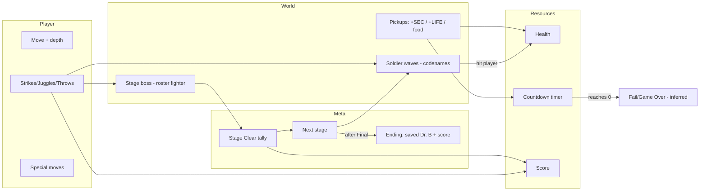

# Tekken 3 — "Tekken Force" Mode — Gameplay Teardown & Reverse‑Engineering Document

> **Analyst role:** Game systems / gameplay design / technical art / UI‑UX / level design research
> **Method:** Frame‑accurate visual analysis of one YouTube capture, downloaded with `yt-dlp` and
> decomposed into contact‑sheet montages + full‑resolution key frames with `ffmpeg`.
> **Evidence tagging:** `[CONFIRMED]` = directly visible/legible on screen · `[INFERENCE]` = reasoned from
> visible evidence · `[UNKNOWN]` = cannot be determined from the footage.

## Source Material

| Ref     | Video                                                              | Channel      | Length | Value                                                                                                                                                                                           |
| ------- | ------------------------------------------------------------------ | ------------ | ------ | ----------------------------------------------------------------------------------------------------------------------------------------------------------------------------------------------- |
| **TF**  | `7u8eRmsZXIo` — "Tekken 3 HD/HQ – 100% Walkthrough – Tekken‑Force" | BlueGangsta  | 7:14   | Clean, overlay‑free **complete** single‑character run (Jin) of Tekken Force mode: menu → 4 stages + Final Stage → ending.                                                                       |
| **TF2** | `hrnb5U3w4wU` — "Tekken 3 (Tekken Force Mode) — Longplay"          | Long 'n Play | 38:24  | **Multi‑character** longplay: consecutive full runs as **Hwoarang, Xiaoyu, Paul, King**; reveals boss variety, the **keys / completion‑%** meta, "FINAL STAGE CHALLENGE", and the Dr. B finale. |

Timestamps below are `mm:ss`, prefixed **TF** (BlueGangsta 7:14) or **TF2** (Long 'n Play 38:24), and are
**approximate** (derived from overview sampling), marked `~`.

**Identification `[CONFIRMED]`:** _Tekken 3_ (PlayStation, Namco). The main‑menu **TEKKEN 3** logo (~0:02)
and stage cards confirm the game; the analyzed content is its side‑scrolling beat‑'em‑up sub‑mode,
**"TEKKEN FORCE"** (title cards throughout, e.g. ~0:05).

> **Context for this project:** Tekken Force is a **fighting‑game engine repurposed as a scrolling
> brawler** — the same 3D character/movesets from the versus game, driven through linear beat‑'em‑up
> stages. That hybrid is directly relevant to ProjectMannequin's side‑scroll‑plus‑fighter direction.

---

## 1. High‑Level Game Summary

- **Genre `[CONFIRMED]`:** Side‑scrolling **beat‑'em‑up** built on Tekken's **3D fighting engine**
  (full polygonal fighters, depth movement). A "brawler mode" inside a versus fighting game.
- **Core loop `[CONFIRMED]`:** Advance right along a linear corridor → waves of **Tekken Force soldiers**
  approach → defeat them with Tekken strings/throws → reach a **named boss** at the stage end → **STAGE
  CLEAR** score tally → next stage. A **countdown timer** presses the player throughout.
- **Player objective `[CONFIRMED]`:** Clear the **4 core stages** (and the bonus Final Stage when unlocked); the ending reveals the narrative goal —
  **"YOU SAVED DR. BOSKONOVITCH!"** (~7:00), i.e. fight through the syndicate's facilities to rescue him.
- **Camera `[CONFIRMED]`:** Side‑on tracking camera with **3D depth** — Jin moves left/right and into/out
  of the plane; the camera follows horizontally down each corridor.
- **Visual style `[CONFIRMED]`:** Late‑1990s low‑poly 3D characters (this capture is an upscaled "HD"
  emulation) on themed 3D environments (streets, desert, facility, prison, underground).
- **Pacing `[CONFIRMED]`:** Fast and continuous; the whole mode is ~7 minutes. Near‑constant combat with
  brief title/clear screens between stages.
- **Player count `[CONFIRMED single‑player shown]`:** One player (Jin). Co‑op is **not** shown `[UNKNOWN]`.
- **Moment‑to‑moment `[CONFIRMED]`:** Walk right, intercept incoming soldiers, chain Tekken combos/throws,
  grab **+SEC**/**+LIFE** pickups, and beat the stage boss before the timer runs out.

**Summary:** A bite‑sized single‑player brawler mode that reuses Tekken 3's fighters and combat to send one
chosen character through **four core stages** (plus a conditional Underground finale) of uniformed soldiers and **roster‑character bosses that vary per run**, under time
pressure, to rescue Dr. Boskonovitch — scored on speed, survival and bonuses.

---

## 2. Full Player Workflow (Launch → Completion)

| #   | Step                        | Evidence       | What happens                                                                                                                                         |
| --- | --------------------------- | -------------- | ---------------------------------------------------------------------------------------------------------------------------------------------------- |
| 1   | **Main menu / mode select** | ~0:02          | TEKKEN 3 logo + mode list: **Tekken Ball Mode / Tekken Force Mode / Practice Mode / (Theater Mode)**; player selects **Tekken Force**. `[CONFIRMED]` |
| 2   | **Character select**        | ~0:00          | Roster portrait grid (Tekken 3 cast); **any fighter is playable** — TF plays Jin, TF2 plays Hwoarang/Xiaoyu/Paul/King. `[CONFIRMED]`                 |
| 3   | **Stage title card**        | ~0:05          | **"TEKKEN FORCE / STAGE 1 / BACKSTREETS"** with the character's face + red‑lightning motif. `[CONFIRMED]`                                            |
| 4   | **"READY?"**                | ~0:08          | Stage‑start prompt over the level. `[CONFIRMED]`                                                                                                     |
| 5   | **In‑stage brawl**          | ~0:10+         | Advance right, fight soldier waves, grab pickups (see §4). `[CONFIRMED]`                                                                             |
| 6   | **Stage boss**              | ~1:28 (Paul) … | A named roster fighter with a red health bar + name plate. `[CONFIRMED]`                                                                             |
| 7   | **STAGE CLEAR!!**           | ~1:30          | Tally: **Stage Bonus / Clear Bonus / Clear Time / Bonus Time**. `[CONFIRMED]`                                                                        |
| 8   | **"NOW LOADING"**           | ~1:25          | Inter‑stage load screen. `[CONFIRMED]`                                                                                                               |
| 9   | **Repeat Stages 2–4**       | ~1:33–6:07     | Desert → **Darkness** → Prison, each ending in a boss + clear tally. `[CONFIRMED]`                                                                   |
| 10  | **Final Stage**             | ~6:30          | **"TEKKEN FORCE / FINAL STAGE / UNDERGROUND"**; culminates with **"DOCTOR B."**. `[CONFIRMED]`                                                       |
| 11  | **Ending / score**          | ~7:00          | **"TEKKEN FORCE — YOUR SCORE: 112250 / HIGH SCORE: 133190"** + **"YOU SAVED DR. BOSKONOVITCH!"**. `[CONFIRMED]`                                      |

**Workflow shape `[CONFIRMED]`:** **Menu → single character pick → fixed sequence of 4 stages (+ a conditional Final Stage) → score
ending.** The only meaningful player choice is the character; the run is otherwise a straight gauntlet.

---

## 3. Character Analysis

- **Playable characters `[CONFIRMED]`:** **any roster fighter** can run the mode with their **own full versus
  moveset**. Demonstrated across the two videos: **Jin** (TF), **Hwoarang, Xiaoyu, Paul, King** (TF2). Each
  keeps its versus silhouette, strings, launchers, throws and specials — e.g. Paul's fiery straight‑punch
  (TF2 ~28:28), King's grapples.
- **Moveset/animation `[CONFIRMED]`:** the **full Tekken versus moveset** — left/right punch & kick strings,
  launchers, **juggles**, and **throws** — with impact sparks and special‑move VFX (e.g. a purple/red burst
  during a Nina fight, TF ~3:00). Movement includes stepping into/out of depth.
- **Readability `[CONFIRMED]`:** the played fighter is high‑contrast and clearly silhouetted against the
  muted, uniformed soldiers and dim sets.
- **Bosses double as roster characters `[CONFIRMED]`:** stage bosses are versus‑mode fighters (Paul, Nina,
  Hwoarang, Heihachi, Eddy, Law, Jin, Julia, Gun Jack, Tiger, Kuma, King…), reusing the same models/movesets
  as opponents; **which bosses appear varies per run** (see §8).

---

## 4. Core Gameplay Mechanics

| Mechanic                          | Trigger `[INFERENCE unless noted]` | Feedback `[CONFIRMED]`                                                                                      | Role            |
| --------------------------------- | ---------------------------------- | ----------------------------------------------------------------------------------------------------------- | --------------- |
| **Movement (left/right + depth)** | Directional input                  | Character advances down corridor; can shift in Z                                                            | Core            |
| **Strikes / strings**             | Punch/kick buttons                 | Hit sparks, hitstun, enemy stagger                                                                          | Core            |
| **Juggles / launchers**           | Combo routing                      | Enemies popped up and hit airborne                                                                          | Core            |
| **Throws**                        | Grab adjacent enemy                | Enemy thrown/slammed                                                                                        | Core            |
| **Special moves**                 | Character‑specific inputs          | Elemental/energy VFX + damage number (e.g. "38″11", ~3:00)                                                  | Core            |
| **Countdown timer**               | —                                  | Large center number that **decreases over time** and is **refilled by +SEC pickups** (oscillates, caps ~99) | Pressure/pacing |
| **Health**                        | —                                  | Cyan/teal player health bar; **+LIFE!** pickups restore it                                                  | Core            |
| **Enemy health + name**           | Engaging a foe                     | Red bar + name plate top‑right (soldier codename or boss name)                                              | Core            |
| **Pickups**                       | Walk over / drops                  | **+SEC** (time), **+LIFE!** (health), on‑ground food/items                                                  | Resource        |
| **Score & bonuses**               | Kills + stage clear                | Yellow **SCORE**, fixed **HI‑SCORE 133190** target, clear tally                                             | Meta            |
| **Bosses**                        | Stage end                          | Named roster fighter with health bar                                                                        | Climax          |
| **Rescue objective**              | Final stage                        | "YOU SAVED DR. BOSKONOVITCH!"                                                                               | Narrative goal  |

**Not present in footage `[CONFIRMED absence]`:** shops, currency, inventory screen, crafting, leveling,
skill trees, branching paths, co‑op. Persistent resources are only **Health, Timer, and Score**.

> **Bottom bar `[INFERENCE]`:** a row of small evenly‑spaced icons sits along the bottom edge during play
> (e.g. ~0:20, ~3:00). It reads as a **progress/pickup indicator** (distance or collected items), but its
> exact function is not legible — marked inference.

---

## 5. Character ↔ Map/Environment Interaction

| Interaction                   | Timestamp       | Detail                                          | Required?                        |
| ----------------------------- | --------------- | ----------------------------------------------- | -------------------------------- |
| Collect **+SEC** (time)       | ~0:40, ~2:10    | Extends the countdown timer                     | Optional (strongly incentivized) |
| Collect **+LIFE!** (health)   | ~1:55, ~3:20    | Restores health                                 | Optional                         |
| Pick up **food/ground items** | Stage 3 (~3:35) | Item on floor, presumably health/score          | Optional                         |
| **Advance‑right gate**        | each stage      | Progress by clearing/moving; corridor is linear | Required                         |
| **Reach the boss**            | stage ends      | Triggers the named boss encounter               | Required                         |

**Not shown `[CONFIRMED absence]`:** chests, switches, doors opened by the player, climbing, vehicles, NPC
dialogue, save points. Interaction is **combat + walk‑over pickups + reach‑the‑end**.

---

## 6. Map / Level / Stage Layout Analysis

**Macro structure `[CONFIRMED]`:** **Linear, stage‑based** gauntlet of **four core stages** plus a
**conditional Final Stage** (see §7), each a single left‑to‑right corridor with a boss at the end. No map
screen, minimap, or branching.

**Per‑stage anatomy `[CONFIRMED]`:** _title card ("STAGE n / NAME") → "READY?" → advance right through
soldier waves → boss → STAGE CLEAR tally → NOW LOADING → next._

**Navigation guidance `[CONFIRMED]`:** the corridor itself funnels the player right; enemies stream from
ahead; no arrows or markers are needed. The countdown timer pushes forward momentum.

**Stages observed (theme + boss; subtitles beyond those read on screen are `[UNKNOWN]`):**

| #   | Stage title read                                                             | Theme (visual evidence)                                 | Boss — **roster fighter, varies per run** |
| --- | ---------------------------------------------------------------------------- | ------------------------------------------------------- | ----------------------------------------- |
| 1   | **BACKSTREETS** `[CONFIRMED]`                                                | Grungy urban street (barrels, brick, "PIZZERIA")        | e.g. Paul (TF) / Kuma / King / Eddy       |
| 2   | "STAGE 2" (subtitle `[UNKNOWN]`)                                             | **Desert canyon** (red rock)                            | e.g. Nina (TF) / Law / Julia / Gun Jack   |
| 3   | **DARKNESS** `[CONFIRMED, TF2 ~33:00]`                                       | **Facility** (dark, fenced corridors)                   | e.g. Hwoarang (TF) / Jin / others         |
| 4   | "STAGE 4" (subtitle `[UNKNOWN]`)                                             | **Prison / industrial** (pillars, cell bars, red floor) | almost always **Heihachi** (both videos)  |
| ★   | **FINAL STAGE — UNDERGROUND** `[CONFIRMED]` — **conditional bonus** (see §7) | Black underground passage                               | **Doctor B.**                             |

---

## 7. Stage Progression & Completion Flow

**Per‑stage flow `[CONFIRMED]`:** title card → **READY?** → brawl → boss → **STAGE CLEAR!!** with a scoring
breakdown, e.g. Stage 1 (~1:30): **STAGE BONUS 5000 / CLEAR BONUS 8500 / CLEAR TIME 00'15"53 / BONUS TIME
00'24"47**; Stage 4 (~6:07): **STAGE BONUS 20000 / CLEAR BONUS 2300 / CLEAR TIME 00'24"70**.

**Scoring model `[CONFIRMED/INFERENCE]`:** score accumulates across the run (000 → 112,250) toward a fixed
**HI‑SCORE 133190** target; each clear adds a **stage bonus** (grows per stage), a **clear bonus**, and a
time‑based bonus. `[INFERENCE]` faster clears / leftover timer yield more bonus.

**Conditional Final Stage `[CONFIRMED, TF2]`:** the base run is **4 stages**. Clearing Stage 4 normally shows
**"YOU GOT A KEY!!"** and ends the run (TF2 Hwoarang run ~11:06); but under the right conditions the Stage‑4
clear instead reads **"FINAL STAGE CHALLENGE!!"** (TF2 King run ~37:12) and opens the bonus **Final Stage —
UNDERGROUND** vs **Doctor B.** `[INFERENCE]` the trigger is accumulated **keys** across multiple completions
(consistent with the known "clear Tekken Force several times to unlock Dr. Boskonovitch" design).

**Meta‑progression — KEYS & completion `[CONFIRMED, TF2]`:** each completion awards a **key** ("YOU GOT A
KEY!!"; the ending lists **"KEYS: COPPER"**), shown as **key icons in the bottom‑left HUD** that **accumulate
across runs** (1 → 2 keys over successive King‑run stages). A **"CHARACTERS"** screen tracks **per‑character
completion** (e.g. Paul / Hwoarang / Eddy **33.3%**, others **0×**) — replaying with different fighters is the
meta‑progression. Beating the high score shows **"NEW RECORD!!"** and HI‑SCORE updates (133300 → 146930
across the longplay).

**Completion `[CONFIRMED]`:** after the Final Stage, an ending card shows **YOUR SCORE / HIGH SCORE** and
**"YOU SAVED DR. BOSKONOVITCH!"** — the mode's win state and narrative payoff.

> **Final boss `[CONFIRMED name plate; relationship INFERENCE]`:** the Final Stage pits the player against
> **"DOCTOR B."** on a red health bar (both videos) — i.e. he is **fought as the final boss** — and on
> clearing, the ending frames it as having **saved** him.

---

## 8. Enemies, NPCs & AI Behavior

**Grunts — "Tekken Force" soldiers `[CONFIRMED]`:** uniformed troopers that stream in from ahead and attack
with basic strikes; identified by **codename name plates**: **CROW, FALCON, HAWK, OWL** (bird codenames,
per stage). Low individual health; dangerous in numbers.

**Bosses `[CONFIRMED]`:** roster fighters used as end‑of‑stage opponents, each with a full versus moveset and
a named red health bar. **The boss line‑up varies per run** (TF2) — across the two videos the stage bosses
include **Paul, Nina, Hwoarang, Heihachi, Eddy, Law, Jin, Julia, Gun Jack, Tiger, Kuma and King**. Two
regularities: **Stage 4 (Prison) is almost always Heihachi**, and the **Final Stage boss is always Doctor B.**

| Stage                 | Boss(es) observed             | Notes                                  |
| --------------------- | ----------------------------- | -------------------------------------- |
| 1 Backstreets         | Paul / Kuma / King / Eddy     | varies per run                         |
| 2 Desert              | Nina / Law / Julia / Gun Jack | varies; special‑move VFX ~3:00         |
| 3 Darkness (facility) | Hwoarang / Jin / others       | varies                                 |
| 4 Prison              | **Heihachi** (both videos)    | the consistent Stage‑4 boss            |
| Final Underground     | **Doctor B.**                 | conditional bonus stage; rescue ending |

**AI behavior `[CONFIRMED/INFERENCE]`:** soldiers advance and swing; bosses use the fuller fighting‑game AI
(blocks, combos, specials). `[INFERENCE]` grunts = simple approach‑and‑attack; bosses = versus‑grade AI.

**Friendly NPCs `[CONFIRMED]`:** none interactive in the stages; **Dr. Boskonovitch** exists only as the
rescue target referenced at the end.

---

## 9. Combat & Encounter Design

- **Player offense `[CONFIRMED]`:** Tekken strings, launchers, **juggles**, throws, and special moves — the
  versus engine's full vocabulary applied to crowds.
- **Feedback `[CONFIRMED]`:** hit sparks, hitstun/stagger, knockdowns, and floating **damage numbers**
  (e.g. "38″11").
- **Encounter design `[CONFIRMED]`:** continuous soldier waves that require **crowd control** (spacing,
  using launchers/throws to manage multiple foes) punctuated by **1‑v‑1 boss duels** that test the fighting
  fundamentals.
- **Pressure `[CONFIRMED]`:** the **countdown timer** converts the brawl into a **time attack** — the player
  must kill efficiently and grab **+SEC** to avoid running out.
- **Skills tested `[INFERENCE]`:** combo execution, crowd spacing, and speed — more execution‑ and
  tempo‑driven than resource management.

---

## 10. Items, Pickups & Economy

| Item                   | Appearance               | Obtained        | Effect                                | Persistence    |
| ---------------------- | ------------------------ | --------------- | ------------------------------------- | -------------- |
| **+SEC**               | Floating "+2/4 SEC" text | Drops / on path | **Adds time** to the countdown        | Consumed       |
| **+LIFE!**             | Floating "+LIFE!" text   | Drops / on path | **Restores health**                   | Consumed       |
| **Food / ground item** | Small prop on floor      | Walk over       | Presumably health/score `[INFERENCE]` | Consumed       |
| **Score**              | Yellow number            | Kills + bonuses | Progress toward **HI‑SCORE 133190**   | Run‑persistent |

**Economy model `[CONFIRMED]`:** no shops or currency spending. The **in‑run** economy is **time and score**
(time is a spendable/refillable resource; score + bonuses measure mastery against the HI‑SCORE). The
**meta‑economy is KEYS** (§7): each completion awards a key — shown as **bottom‑left HUD icons** that
accumulate across runs (ending "KEYS: COPPER") — gating the bonus Final Stage / Dr. Boskonovitch unlock
`[CONFIRMED keys exist; exact gate INFERENCE]`.

---

## 11. HUD & UI Analysis

**In‑game HUD `[CONFIRMED]`:**

| Element                                  | Location                  | Communicates                                                                                                           |
| ---------------------------------------- | ------------------------- | ---------------------------------------------------------------------------------------------------------------------- |
| **Character portrait + name ("JIN")**    | Top‑left                  | Played character                                                                                                       |
| **SCORE** (yellow)                       | Top‑left, under bar       | Running score                                                                                                          |
| **Player health bar** (cyan/teal)        | Top‑left                  | Current HP                                                                                                             |
| **Countdown timer** (large white number) | Top‑center                | Time remaining (refilled by +SEC)                                                                                      |
| **HI‑SCORE 133190**                      | Top‑right                 | Fixed target score                                                                                                     |
| **Enemy health bar (red) + name**        | Top‑right                 | Current foe HP + codename/boss name                                                                                    |
| **Damage numbers** ("38″11")             | At impact                 | Per‑hit damage                                                                                                         |
| **Pickup text** ("+2 SEC", "+LIFE!")     | In world                  | Resource gained                                                                                                        |
| **Key icons + colored bar**              | Bottom‑left / bottom edge | **Collected keys** (icons that accumulate across runs, TF2) + a colored segmented bar (function unclear `[INFERENCE]`) |

**Screens `[CONFIRMED]`:** main‑menu mode list; character‑select grid; **stage title cards** ("TEKKEN FORCE
/ STAGE n / NAME" + face); **READY?**; **NOW LOADING**; **STAGE CLEAR!!** tally; **ending score card** with
"YOU SAVED DR. BOSKONOVITCH!".

**UX assessment `[INFERENCE]`:** classic arcade layout — persistent status pinned to the top corners (player
left, enemy right, timer center) leaving the play area clear. The countdown timer's central placement makes
time pressure unmissable.

---

## 12. Graphics, Visual Style & Art Direction

- **Art style `[CONFIRMED]`:** late‑90s **low‑poly 3D** fighters and environments (upscaled/filtered "HD" in
  this capture), with per‑stage themed sets.
- **Color/lighting `[CONFIRMED]`:** distinct per‑stage palettes — grimy grey‑brown streets, red‑rock desert,
  dark blue/green facility, red‑lit prison, black underground — for instant location identity.
- **VFX `[CONFIRMED]`:** hit sparks, dust, knockdown effects, and colored special‑move bursts (Nina ~3:00);
  floating damage/score/time numbers.
- **Transitions `[CONFIRMED]`:** stage title cards with lightning motif, "NOW LOADING", and the CLEAR/score
  tallies.
- **Readability `[CONFIRMED]`:** the player (bright skin + flame trousers) contrasts strongly with the dark,
  uniformed soldiers and muted sets; HUD bars/timer are high‑contrast.

---

## 13. Environment & World Design

- **Settings `[CONFIRMED]`:** urban **Backstreets** → **desert canyon** → dark **facility** → **prison /
  industrial** interior → **Underground** — a descent from the streets into the syndicate's core.
- **Environmental storytelling `[CONFIRMED]`:** signage ("PIZZERIA"), barrels, fences, cell bars and the
  final underground passage imply a covert paramilitary facility guarding a prisoner (Dr. B).
- **Gameplay effect `[CONFIRMED]`:** environments are essentially **flat brawling corridors** that frame
  encounters and funnel the player forward; they are backdrops rather than interactive/explorable spaces —
  no hazards, cover, or secret routes are demonstrated `[CONFIRMED absence in footage]`.
- **Landmarks `[CONFIRMED]`:** each stage's strong theme (street, canyon, prison bars, black tunnel) doubles
  as its identity and its boss stage.

---

## 14. Audio & Feedback Analysis

> **Caveat `[CONFIRMED limitation]`:** analyzed from still frames only; audio was **not** directly analyzed.
> Descriptions below are `[INFERENCE]` grounded in genre and visible cues.

- **Music `[INFERENCE]`:** driving arcade/electronic stage themes typical of Tekken 3, changing per stage.
- **SFX `[INFERENCE from visuals]`:** punchy impact/whiff sounds, throw slams, pickup chimes, boss‑hit cues.
- **Voice `[INFERENCE]`:** short combat grunts and special‑move callouts (Tekken staple).
- **Feedback role `[INFERENCE]`:** audio reinforces hit confirmation and the timer's urgency.

---

## 15. Controls & Input Inference

Tekken 3 uses a **4‑button** fighting scheme; Tekken Force reuses it. No on‑screen prompts were captured, so
all bindings are `[INFERENCE]`.

| Action                  | Inferred input               | Basis                                |
| ----------------------- | ---------------------------- | ------------------------------------ |
| Move left/right + depth | D‑pad / stick                | On‑screen movement `[INFERENCE]`     |
| Left/Right Punch        | 2 face buttons (□, △ on PS)  | Tekken 4‑button layout `[INFERENCE]` |
| Left/Right Kick         | 2 face buttons (✕, ○ on PS)  | Tekken 4‑button layout `[INFERENCE]` |
| Throw                   | Punch+Kick combination       | Throws visible `[INFERENCE]`         |
| Special moves           | Directional + button strings | Special VFX visible `[INFERENCE]`    |
| Menu confirm / cancel   | ✕ / △ (PS)                   | Standard `[INFERENCE]`               |
| Pause                   | Start                        | Standard `[INFERENCE]`               |

Exact bindings are **not shown** and remain `[INFERENCE]`.

---

## 16. Tutorialization & Player Guidance

- **Teaching method `[CONFIRMED/INFERENCE]`:** essentially **none in‑mode** — Tekken Force assumes the
  player already knows the fighting controls (learned in the main game / Practice Mode, which is on the menu
  ~0:02). Guidance is purely **structural**: linear corridor, incoming enemies, and the visible timer.
- **Guidance cues `[CONFIRMED]`:** **READY?** signals start; **+SEC/+LIFE!** floating text teaches pickups;
  the enemy name plate/health bar signals a boss; **STAGE CLEAR** confirms success.
- **Onboarding `[INFERENCE]`:** relies on transfer from the versus game; no contextual pop‑up tutorials
  appear in the footage.

---

## 17. Systems Model

| System          | Inputs                   | Outputs                   | Rules                                                        | Feedback                     | Depends on      |
| --------------- | ------------------------ | ------------------------- | ------------------------------------------------------------ | ---------------------------- | --------------- |
| **Movement**    | Stick/D‑pad              | Corridor position + depth | Left→right advance                                           | Animation                    | —               |
| **Combat**      | Punch/kick/throw/special | Damage, juggles           | Fighting‑engine rules                                        | Sparks, damage nums, stagger | Player, Enemy   |
| **Health**      | Hits, +LIFE              | HP delta                  | +LIFE restores                                               | Cyan bar                     | Combat, Pickups |
| **Timer**       | Elapsed time, +SEC       | Time remaining            | Counts down; +SEC refills; 0 = fail (inf.)                   | Center number                | Pickups         |
| **Enemy**       | Player proximity         | Waves, boss               | Soldiers stream; boss at end                                 | Approach, red bar+name       | Stage           |
| **Score/Bonus** | Kills, clear, time       | Score total               | Stage/clear/time bonuses                                     | Yellow SCORE, tally          | Combat, Timer   |
| **Stage**       | Boss defeat              | Next stage                | 4 core stages + conditional Final Stage; bosses vary per run | Title card, CLEAR            | Combat          |
| **Ending**      | Final clear              | Win state                 | Rescue Dr. B                                                 | Score card + message         | Stage           |

---

## 18. Timeline Breakdown (evidence‑anchored, approximate)

| Time       | Event                                                                           | System     | HUD/UI                | Location    |
| ---------- | ------------------------------------------------------------------------------- | ---------- | --------------------- | ----------- |
| ~0:02      | Main menu: Tekken Ball / **Tekken Force** / Practice / Theater                  | Front‑end  | Mode list             | Menu        |
| ~0:03      | Character‑select grid; **Jin** chosen                                           | Front‑end  | Roster                | Menu        |
| ~0:05      | **STAGE 1 / BACKSTREETS** title                                                 | Stage      | Title card            | —           |
| ~0:08      | **READY?**                                                                      | Stage      | Prompt                | Backstreets |
| ~0:10–1:25 | Stage 1 brawl vs soldiers (CROW/FALCON/HAWK)                                    | Combat     | Timer, score climb    | Backstreets |
| ~1:28      | Boss **PAUL**                                                                   | Boss       | Enemy bar "PAUL"      | Backstreets |
| ~1:30      | **STAGE CLEAR** (5000 / 8500 / 15"53 / 24"47)                                   | Reward     | Tally                 | —           |
| ~1:33      | **STAGE 2** (desert)                                                            | Stage      | Title                 | Desert      |
| ~3:00      | Boss **NINA** (special VFX, "38″11")                                            | Boss       | Enemy bar "NINA"      | Desert      |
| ~3:18      | **STAGE CLEAR** (10000 / 6600 / 16"96 / 33"04)                                  | Reward     | Tally                 | —           |
| ~3:22      | **STAGE 3** (facility)                                                          | Stage      | Title                 | Facility    |
| ~4:15      | Boss **HWOARANG**                                                               | Boss       | Enemy bar             | Facility    |
| ~4:35      | **STAGE CLEAR** (15000 / 6800 / 18"71 / 41"29)                                  | Reward     | Tally                 | —           |
| ~4:40      | **STAGE 4** (prison)                                                            | Stage      | Title                 | Prison      |
| ~6:00      | Boss **HEIHACHI**                                                               | Boss       | Enemy bar "HEIHACHI"  | Prison      |
| ~6:07      | **STAGE CLEAR** (20000 / 2300 / 24"70)                                          | Reward     | Tally                 | —           |
| ~6:30      | **FINAL STAGE / UNDERGROUND** title                                             | Stage      | Title card + face     | Underground |
| ~6:55      | **DOCTOR B.** + STAGE CLEAR                                                     | Boss/End   | Enemy bar "DOCTOR B." | Underground |
| ~7:00      | Ending: **YOUR SCORE 112250 / HIGH SCORE 133190 / YOU SAVED DR. BOSKONOVITCH!** | Completion | Score card            | —           |

---

## 19. Design Reverse‑Engineering Summary

- **Core fantasy:** take your favorite Tekken fighter on a one‑person rampage through an army to rescue an ally.
- **Core loop:** _advance → crowd‑fight soldiers → boss duel → clear → next stage,_ under a countdown.
- **Secondary loop:** _manage health & timer via +LIFE/+SEC pickups_ while maximizing score.
- **Meta loop:** _beat your score toward the fixed HI‑SCORE;_ (in the wider game, completing the mode unlocks
  bonus content `[INFERENCE]`).
- **Main verbs:** move, strike, juggle, throw, grab pickups.
- **Main obstacles:** soldier crowds, roster‑fighter bosses, and the clock.
- **Main rewards:** stage/clear/time bonuses, health/time pickups, and the rescue ending.
- **Failure conditions `[INFERENCE]`:** health depleted or timer to zero.
- **Structure:** fixed 4‑stage gauntlet (+ conditional Final Stage), boss‑capped, score‑graded.
- **Communication:** top‑corner status + central timer; strong hero/enemy contrast; boss = named red bar.

---

## 20. Clone / Reference Design Notes

### Must‑Have (core to function)

| Feature                                              | What it does                     | Why it matters                 | Evidence       | Complexity              |
| ---------------------------------------------------- | -------------------------------- | ------------------------------ | -------------- | ----------------------- |
| Reuse a fighting‑engine moveset in a scrolling stage | Strings/juggles/throws vs crowds | The whole identity of the mode | TF throughout  | High                    |
| Left‑to‑right corridor + soldier waves               | Beat‑'em‑up pacing               | Structure                      | ~0:10+         | Low                     |
| Countdown timer refilled by pickups                  | Time‑attack pressure             | Drives tempo & tension         | timer + "+SEC" | Medium                  |
| Named end‑of‑stage bosses                            | Skill‑check climaxes             | Encounter peaks                | Paul/Nina/…    | Medium (reuse fighters) |
| Stage title cards + STAGE CLEAR tally                | Framing & scoring                | Readability + reward           | ~0:05 / ~1:30  | Low                     |
| Top‑corner HUD (player L / enemy R / timer C)        | Status readout                   | Arcade clarity                 | ~0:20          | Low                     |

### Should‑Have

| Feature                                         | What it does        | Why                     | Evidence      | Complexity              |
| ----------------------------------------------- | ------------------- | ----------------------- | ------------- | ----------------------- |
| Character select (any roster fighter)           | Replay variety      | Longevity               | ~0:03         | Low (if fighters exist) |
| +LIFE / +SEC pickups                            | Health/time economy | Moment‑to‑moment stakes | ~1:55 / ~0:40 | Low                     |
| Score + fixed HI‑SCORE target                   | Mastery chase       | Replay                  | HUD           | Low                     |
| Soldier codename variety (Crow/Falcon/Hawk/Owl) | Flavor + tiers      | Identity                | name plates   | Low                     |
| Rescue/narrative payoff                         | Goal + closure      | Motivation              | ~7:00         | Low                     |

### Nice‑to‑Have

| Feature                       | What it does      | Why          | Evidence            | Complexity |
| ----------------------------- | ----------------- | ------------ | ------------------- | ---------- |
| Per‑stage themed environments | Distinct identity | Memorability | all stages          | Medium     |
| Damage numbers                | Combat legibility | Feel         | "38″11"             | Low        |
| Special‑move VFX bursts       | Spectacle         | Feel         | ~3:00               | Medium     |
| Bottom progress/pickup bar    | Extra readout     | Orientation  | ~0:20 `[INFERENCE]` | Low        |

---

## 21. Unknowns & Assumptions

### Confirmed Observations

- Content is **Tekken 3 → Tekken Force mode**; **multiple playable characters confirmed** — Jin (TF); Hwoarang, Xiaoyu, Paul, King (TF2), each with their own versus moveset.
- Main menu modes: **Tekken Ball / Tekken Force / Practice / (Theater)**.
- **4 core stages + a conditional Final Stage:** Backstreets → Desert → **Darkness** (facility) → Prison → **Underground** (Final, bonus).
- Bosses are **roster fighters that vary per run** (Paul, Nina, Hwoarang, Heihachi, Eddy, Law, Jin, Julia, Gun Jack, Tiger, Kuma, King seen); **Stage 4 ≈ Heihachi**, **Final = Doctor B.**; soldiers use codenames **Crow/Falcon/Hawk/Owl**.
- HUD: portrait+**JIN**, **SCORE**, **HI‑SCORE 133190**, **countdown timer**, cyan **health bar**, red
  **enemy bar + name**, **damage numbers**.
- Pickups **+SEC** (time) and **+LIFE!** (health); on‑ground items.
- **STAGE CLEAR** tally (Stage/Clear/Clear‑Time/Bonus‑Time); ending **"YOU SAVED DR. BOSKONOVITCH!"** with
  final score **112250** vs high score **133190**.
- **Keys meta (TF2):** clears award keys ("YOU GOT A KEY!!" / "KEYS: COPPER"), shown as **bottom‑left HUD
  icons** that accumulate across runs; the Stage‑4 clear can read **"FINAL STAGE CHALLENGE!!"** to open the
  bonus Final Stage. A **CHARACTERS** screen tracks per‑character completion %; **"NEW RECORD!!"** on beating
  the HI‑SCORE.

### Reasonable Inferences

- Full Tekken versus moveset (juggles/throws/specials) is available.
- Timer to 0 (or health to 0) = failure; leftover time feeds score bonuses.
- The accumulated **key count** gates the Final Stage / Dr. Boskonovitch unlock (clear the mode several times).
- The colored bottom bar's exact function (progress vs. a meter) is unclear.

### Unknowns

- Exact button map and per‑character move inputs.
- Stage 2 & 4 **subtitle names** (Stage 1 = Backstreets, **Stage 3 = Darkness**, Final = Underground are known).
- The exact condition / number of keys that triggers **"FINAL STAGE CHALLENGE"** and the Dr. B unlock.
- Fail/continue rules; whether co‑op or difficulty options exist.
- Audio specifics (not analyzed from stills).

---

## 22. Final Summary

**What it is:** _Tekken Force_, a compact side‑scrolling **beat‑'em‑up mode inside Tekken 3** that reuses the
game's **3D fighting engine and roster**. The player picks a fighter (here **Jin**) and battles through
**four core stages** (Backstreets, Desert, **Darkness**, Prison) plus a **conditional Underground finale** —
against waves of codenamed **Tekken Force soldiers** and **roster‑character bosses that vary per run**
(Heihachi consistently guards Stage 4; **Doctor B.** is the finale), all under a **countdown timer**, to
**rescue Dr. Boskonovitch** and earn **keys** toward unlocking him.

**How the player starts:** main menu → **Tekken Force Mode** → **character select** → Stage 1 title →
**READY?** → play.

**How the character is controlled:** the **full Tekken moveset** (strikes, launchers, juggles, throws,
specials) with left/right + depth movement; state is shown by a top‑corner HUD (portrait, health, score) and
a **central countdown timer** that pickups (**+SEC**, **+LIFE!**) replenish.

**How it interacts with the map:** pure forward brawling down **linear corridors** — no exploration, shops,
or puzzles; just advance, fight crowds, grab pickups, and beat the stage boss.

**Stage structure & progression:** a **4‑stage gauntlet + conditional Final Stage**, each **title card →
brawl → boss → STAGE CLEAR tally**, ending in a **score card + rescue message**; scoring rewards speed and
leftover time, and completions grant **keys** (meta‑progression toward the Dr. Boskonovitch unlock).

**Most important patterns to reproduce:** a **fighting‑engine moveset applied to crowd combat**, a
**countdown‑timer time‑attack loop with time/health pickups**, **named roster bosses** capping linear
themed stages, an **arcade top‑corner HUD with a central timer**, and a clean **title‑card → clear‑tally**
stage rhythm with a short **narrative payoff**. For ProjectMannequin, Tekken Force is the cleanest reference
for "**versus‑fighter combat repurposed as a side‑scrolling stage gauntlet**."

---

_Prepared from frame‑level analysis of the cited video. Items are tagged `[CONFIRMED]` / `[INFERENCE]` /
`[UNKNOWN]`; no claims are made beyond what the footage supports._
